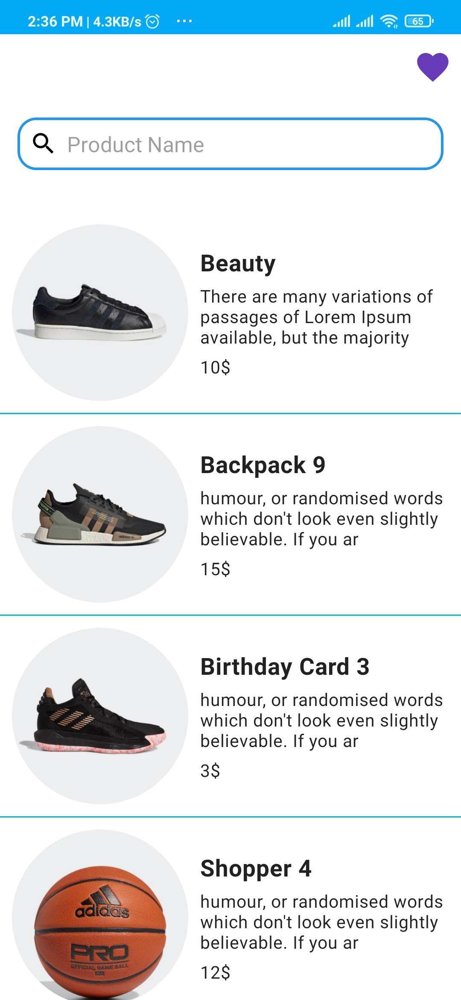
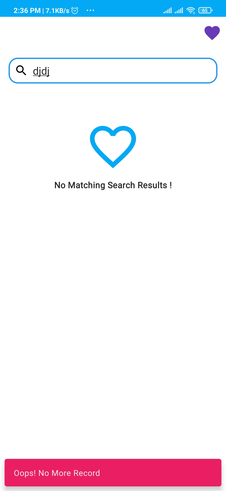

# Case Study (ECommerce API)

An sample ECommerce Android app consuming API to display products with it's details
it has been built with clean architecture principles, Repository Pattern and MVVM
pattern as well as Architecture Components.

Min Api Level : 21 [Supports Over 90% Devices]
compileSdkVersion : 30

## Table of Contents

- [Architecture](#architecture)
- [Testing](#testing)
- [Libraries](#libraries)
- [Screenshots](#screenshots)

## Architecture

the application is expected to scale with multiple developers working on it,
I used the Clean architectural principles to build the application.
I choose this architecture because it offers better separation of concerns and testability.

The Application is split into a three layer architecture:
- Data
- Domain
- Presentation

### Communication between layers
1. UI calls method from ViewModel.
2. ViewModel executes Use case.
3. Use case executes one or multiple Repositorie function.
4. The Repository returns data from one or multiple Data Sources. the repository is the single source of truth
5. Information flows back to the UI where we display the data fetched from data sources.

this diagram show the flow of the data between the each layer.

This provides better abstractions between framework implementations and the underlying business logic.
It requires a number of classes to get things running but the pros outweigh the cons in terms of building an app that should scale.
The 3 layered architectural approach is majorly guided by clean architecture which provides a clear separation of concerns with its Abstraction Principle.

#### Presentation

I used the MVVM pattern for the presentation layer. The Model essentially exposes
the various states the view can be in. The ViewModel handles the UI logic and provides
data via Android architectural component LiveData to the view. The ViewModel talks to
the domain layer with the individual use cases.
Jetpack's Data binding is used to bind the data declaratively to the views.

#### Domain

The domain layer contains the application specifics logic. It contains
use cases that expose the actions that can be performed in the application.

The UseCases use a `MainUseCase` interface that defines the parameters its taking in and
output and also handles running the UseCases in a background thread leveraging Kotlin Coroutines.

#### Data

The data layer handles the business logic and provides data from the 
API and a local database leveraging Room. 
This layer uses the Repository pattern to fetch data from various data sources which in
this case is the Remote API and a local database.

## Testing

Each module has its own tests except for the `domain` module which is catered for since its
part of the behavior under test.

All server responses in the tests are served by mock web server by appending relative urls to
the localhost and the connected port as the base url.

In the `data-remote` module the responses are mocked using the mockwebserver and verified that they
are what we expect.

In the `data-local` module an in  memory database is being used to run the tests,this makes it a 
little faster compared to an actual db.

In the `app` module there are unit tests for the viewmodels and util classes.
 
## Libraries

Libraries used in the whole application are:

- [Jetpack](https://developer.android.com/jetpack)🚀
  - [Viewmodel](https://developer.android.com/topic/libraries/architecture/viewmodel) -Store and manage UI related data in a lifecycle conscious way and act as a channel between use cases and ui
  - [Data Binding](https://developer.android.com/topic/libraries/data-binding) - support library that allows binding of UI components in  layouts to data sources,binds character details and search results to UI
  - [Room](https://developer.android.com/training/data-storage/room) - Provides abstraction layer over SQLite
- [Retrofit](https://square.github.io/retrofit/) - type safe http client and supports coroutines out of the box.  
- [Moshi](https://github.com/square/moshi) - JSON Parser,used to parse requests on the data layer for Entities and understands Kotlin non-nullable and default parameters
- [okhttp-logging-interceptor](https://github.com/square/okhttp/blob/master/okhttp-logging-interceptor/README.md) - logs HTTP request and response data.
- [coroutines](https://github.com/Kotlin/kotlinx.coroutines) - Library Support for coroutines,provides `runBlocking` coroutine builder used in tests
- [Truth](https://truth.dev/) - Assertions Library,provides readability as far as assertions are concerned
- [MockWebServer](https://github.com/square/okhttp/tree/master/mockwebserver) - web server for testing HTTP clients ,verify requests and responses on the APO with the retrofit client.
- [Material Design](https://material.io/develop/android/docs/getting-started/) - build awesome beautiful UIs.🔥🔥
- [Koin](https://github.com/InsertKoinIO/koin) - A pragmatic lightweight dependency injection framework for Kotlin
- [Robolectric](http://robolectric.org/) - Unit test on android framework.
- [recyclerview-animators](https://github.com/wasabeef/recyclerview-animators) - Recycler View Animations

## Screenshots

  
  
  

  
  

  

  

  

  

